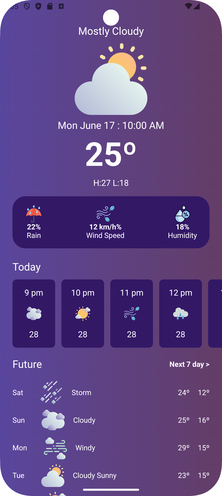

# android_weather

A modern weather forecast app built using **Jetpack Compose**, designed with static screens and layout elements to showcase weather information through a clean and simple design.

## Features

- Current Weather UI: Displays basic weather information such as temperature, humidity, and wind speed.
- Hourly Forecast UI: Scrollable interface showing hourly weather forecast.
- 7-Day Forecast UI: A simple display of weather for the upcoming week.
- Themed Display: Backgrounds and icons change based on weather conditions like sunny or cloudy.

## Screenshots

  

